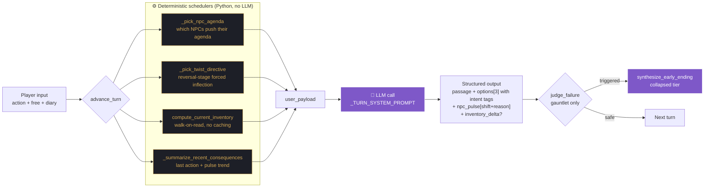
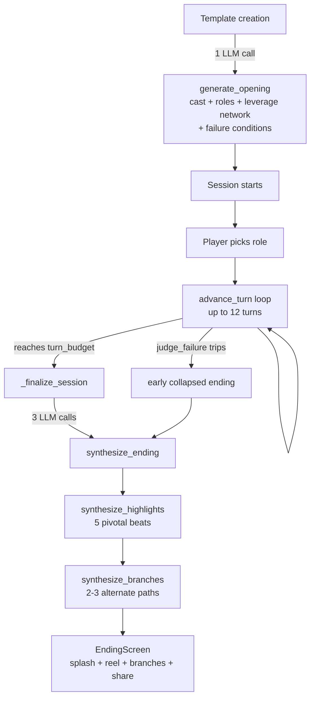

# 架构 / Architecture

本文按 **9 层机制 + 1 套后游戏系统真实运行的顺序**讲清 Tiny Stories
narrative engine 的设计.线性阅读 — 每一层都建立在前面的基础上.

所有结论的 reference 是 `rpg_backend/narrative/engine.py`.如果本文的描述
和文件里的 prompt 字符串 / scheduler 函数对不上,**以代码为准** —
请提 issue.

> Language: 本文是中文版 · English mirror at [ARCHITECTURE.en.md](./ARCHITECTURE.en.md)

## 一图看懂 — 每回合 pipeline



## Session 生命周期



---

## 0. 两阶段架构

每个 session 有两个阶段:

| 阶段 | 触发 | LLM 调用 | 涉及机制 |
|---|---|---|---|
| **Opening 生成** | template 创建 | 1 | cast / player roles / failure conditions / inter-NPC leverage |
| **每回合推进** | 每次 `advance_turn` | 1-3 | NPC 调度 / twist / consequences / inventory / role / diary / oracle |
| **Finalize** | 到达 turn_budget 或 judge_failure 触发 | 3 | ending / highlights / branches |

opening 输出会**持久化为 Template**,可被同一玩家或不同玩家重复消费.
一个 template 可以孕育多个 sessions.

---

## 1. Opening — `generate_opening`

单次 LLM 调用,使用 `_OPENING_SYSTEM_PROMPT`.产出:

- **`title`** — 故事标题
- **`advisor_persona`** — 物理上不在场、可电话联系的"军师朋友"
- **`cast`** (3-5 NPCs) — 每个含:
  - `hidden_objective` — 真实想要的(gauntlet 限定)
  - `leverage_over_player` — 握在玩家头上的把柄
  - `leverages_over_other_npcs` — N×N 政治网络(3-NPC 至少 4 条 edge,4-NPC 至少 6 条;稀疏会触发重试)
- **`player_role_options`** (3-5 张身份卡):
  - `public_persona`(NPC 看到的你)
  - `hidden_objective`(只有玩家 + LLM 知道)
  - `leverages_over_npcs`(玩家手里的反将牌)
  - `starting_assets`(玩家开局握着的具体物件)
- **`player_goals`** + **`failure_conditions`**(gauntlet 限定)
- **`opening_passage`** + 3 个起手 `options`

### 为什么是这个结构

后面所有机制都依赖这些结构化字段.没有 `hidden_objective`,引擎无法
schedule "主动出招"; 没有 `leverages_over_other_npcs`,reversal twist
没有引信; 没有 `player_role_options`,重玩无变化轴.

---

## 2. 每回合 pipeline — `advance_turn`

单次 LLM 调用,使用 `_TURN_SYSTEM_PROMPT`,但 user_payload 由一系列
确定性 scheduler 各自贡献一个结构化字段拼起来:

```
advance_turn(history, player_action, player_diary, ...)
   │
   ├─ stage_phase = _stage_for(turn_index, turn_budget)
   │     hook → pressure → reversal → climax → pre_finale
   │
   ├─ npc_agenda  = _pick_npc_agenda(stage_phase, cast, history)
   │     gauntlet only. 选 0-2 个 NPC 在本回合主动推自己的 hidden_objective
   │     (probe / pressure / leverage / reveal / betray / ally).冷场的 NPC
   │     (近期 pulse 都是 steady)优先,airtime 自然均衡.
   │
   ├─ twist_directive = _pick_twist_directive(stage_phase, cast, role)
   │     仅 reversal 阶段.强制结构性翻转: leverage 揭穿 / 倒戈重组 /
   │     persona 裂缝 / 隐藏 NPC 入场 / 外部事件介入.
   │
   ├─ current_inventory = compute_current_inventory(starting_assets, history)
   │     walk-on-read: starting_assets + Σ(narrator.inventory_delta).
   │     单一真值源,与消息流永不 desync.
   │
   ├─ recent_consequences = _summarize_recent_consequences(history, cast)
   │     {last_player_action, npc_pulse_trend (per NPC, 近 4 beats),
   │      unused_leverage 还没出过牌的 NPC}
   │
   └─ player_role + player_diary + player_goals 原样穿过
        ↓
   LLM (with _TURN_SYSTEM_PROMPT) 返回:
   {
     passage,
     options[3]  (每个带 [intent tag] 前缀),
     npc_pulse[] (每个 NPC 含 shift + reason),
     inventory_delta (可选)
   }
```

每个 input 字段在 prompt 里都有对应的规则段.**prompt 是 scheduler 输出
和 LLM 行为之间的契约** — 当 LLM 忽略某个信号,问题几乎都在 prompt 段
而不是 Python 代码里.

---

## 3. 失败判定 — `judge_failure`

gauntlet 模式每回合后跑.轻量 LLM 调用(≤400 tokens),输入近 5 条
message + failure_conditions 列表,返回:

```json
{ "triggered": bool, "matched_condition_label": str, "reason": str }
```

保守偏置:不确定时返回 `triggered: false`.spec 目标是 80%+ 谨慎玩家
不会触发.触发时,service 跳过标准 finale,改调
`synthesize_early_ending`,强制 label 落在 collapsed pool: `失控 / 反噬 / 破碎 / 沉沦`.

---

## 4. 玩家资源 — diary + oracle

玩家在"选选项"之外延伸 agency 的两条路径.

### `player_diary`(免费)
可选的内心独白,提交时和 action 一起.NPC **看不到**.LLM 用它来
calibrate 内心戏的 register("演 vs 真"的缝隙).持久化在 player message
上,scrollback 时是私密的心路历程.

### `ask_advisor_oracle`(消耗 1 个 turn budget)
单独的 LLM 调用(`_ORACLE_SYSTEM_PROMPT`),advisor 看到**特权信息** —
完整 cast 含 hidden_objective + leverage + NPC pulse trend +
failure_conditions + current_inventory.必须给一段语气合宜、模糊但有用
的 hint,且不能泄露字段名("我读出来" 而不是 "她的 hidden_objective 是…"),
最后必须把决定权交还给玩家.

代价是真的:`repository.decrement_turn_budget()` 仅在 LLM 调用成功后
执行,失败的 oracle 调用免费.

---

## 5. Finalize — 三次后游戏 LLM 调用

session 到达 `turn_budget`(或 judge_failure 触发)时,三次独立调用按顺序
跑.三次都是非致命的 — 失败时空结果不会阻塞 ending screen.

### `synthesize_ending`(或 `synthesize_early_ending`)
生成 closing passage(400-600 字)、从封闭 15-ending pool 里选 label、
第一人称副标题(≤ 25 字,可截图).off-pool label 通过
`_normalize_ending_label` snap 到最近的合法标签.

### `synthesize_highlights`(5 张卡)
LLM 从本局挑 5 个关键 narrator beat,每张含:
- `beat_ord` — 实际 beat 的 ord
- `headline`(≤ 30 字,可截图)
- `body_excerpt` — 该 beat 1-3 句原文
- `why_pivotal`(≤ 80 字,机制感知)

prompt 显式偏好含 inventory_delta / pulse=broken / twist directive /
leverage play 的 beat — **事件**,不是铺垫.

### `synthesize_branches`(2-3 张卡)
后游戏 replay hook.LLM 选 2-3 个 pivot turn,如果当时选了不同选项**会
导致不同 ending label**(对照 ENDING_LABELS pool 校验,与实际 ending
相同的会被 reject).返回:
- `pivot_beat_ord`
- `chosen_path_summary`(玩家走了什么)
- `alternate_path_summary`(玩家本可以怎么走)
- `alternate_ending_label` + tier(server-side 从 label 推导)
- `rationale`(1-2 句"我推测..."口吻)

第一次返回 < 2 张时重试一次.hardcore 玩家的重玩价值取决于这层.

---

## 6. 封闭 ending pool

`ENDING_LABELS` 含 15 个 label,通过 `_LABEL_TIER` 映射到 3 个 tier:

| Tier | Labels |
|---|---|
| **victory** | 复仇 · 和解 · 自由 · 救赎 · 回归 · 夺回 |
| **compromised** | 孤狼 · 共谋 · 牺牲 · 同谋 · 决裂 |
| **collapsed** | 沉沦 · 失控 · 反噬 · 破碎 |

封闭 pool 是有意为之.同一个 template 5 个人玩,label 应当出现碰撞 —
**这就是社交比较的钩子**("你居然走到了和解?我撕到了反噬").

英文模板时,Label 的规范 ID 仍保留中文,UI 通过 display map 翻译展示.

`tier_for_label(label)` 是 UI 给 ending splash 和 branch 卡片定色的公开
API.

---

## 7. 前端镜像

`frontend2/` 是 React 19 + TypeScript 的薄壳.把
`rpg_backend/narrative/contracts.py` mirror 到
`frontend2/src/api/contracts.ts`.play 页(`play-page.tsx`,~2400 行)
渲染所有结构化信号:

- `StoryBeat` → narration with intensity gradient(calm/rising/peak),
  从 pulse + delta + stage 推导
- `pulseStrip` → 含 shift 颜色 + reason 行的 chip
- `optionBtn` → 解析 `[intent tag]` 前缀 → 彩色 chip + 正文
- `roleBanner` → 实时 `current_inventory` + 角色 leverage + assets
- `EndingScreen` → ending splash + highlight reel + branches grid
- `AdvisorSidechat` 含明确的 "🔮 用 1 回合换情报" 付费按钮
- `StageProgressBar` → 5 段戏剧弧线可视化
- Pulse legend(5 种 shift 含义)

所有前端状态在 React `useState`,无全局 store.hash 路由,部署简单.

UI 文案在 `frontend2/src/shared/lib/i18n.ts`(zh/en bundle),通过
`LanguageProvider` context 选择.locale 持久化在 `localStorage`.

---

## 8. 测试现状

`tests/` 主要覆盖旧 author 模块.`narrative/` 模块当前的测试形态是
**LLM smoke 脚本** — 见 `/tmp/full_chain_sim.py` 和
`/tmp/user_persona_sim.py`.

这是已知 gap.给 scheduler 加确定性单测(无 LLM)是高 ROI 的贡献:
`_pick_npc_agenda`、`_pick_twist_directive`、`compute_current_inventory`、
`_summarize_recent_consequences`、`_parse_branches` 都是输入输出结构化
的纯函数.

---

## 9. 性能 / 成本

qwen3.6-flash 类模型,每 session 经济:

| Op | LLM 调用 | 耗时 | 成本 |
|---|---|---|---|
| `generate_opening` | 1(密度不达标最多重试 2 次) | 12-20s | $0.05 |
| `advance_turn` | 1 | 5-8s | $0.03 |
| `judge_failure`(每回合) | 1 | 3-5s | $0.01 |
| `ask_advisor` | 1 | 3-5s | $0.01 |
| `synthesize_ending` + `_highlights` + `_branches` | 3 | 12-18s | $0.10 |
| **完整 12 回合 session** | ~16-20 | 90-150s | ~$0.50-$0.60 |

如果你做公开部署,**人均日预算硬上限**是首要功能 — 一个用户能在你
注意之前刷掉双位数美元.

---

## 10. 想 PR?从哪里开始

按 leverage 降序:

1. **scheduler 纯函数单测**(无 LLM) — 可靠性最高,门槛最低
2. **provider 抽象** — 当前 `gateway.py` 假定 OpenAI `responses_create`
   形状; 显式的 "OpenAI compatible" / "Anthropic compatible" dispatch
   能拓宽用户群
3. **更多 locale** — i18n scaffold 已有(zh/en),加第三个 locale 需要
   扩 `STRINGS_*` bundle + prompt 语言分支
4. **流式 narration** — 当前 `passage` 是一整段返回; 打字机效果会显著
   改善感知响应
5. **持久化 HUD** — 把 `current_inventory` + 已发现的 inter-NPC leverage
   map 单独做侧栏,而不只是 role banner

结构性变更前请先开 issue 描述方向 — prompt-driven 设计有些不显眼的
不变量,从代码层面看不出来.
