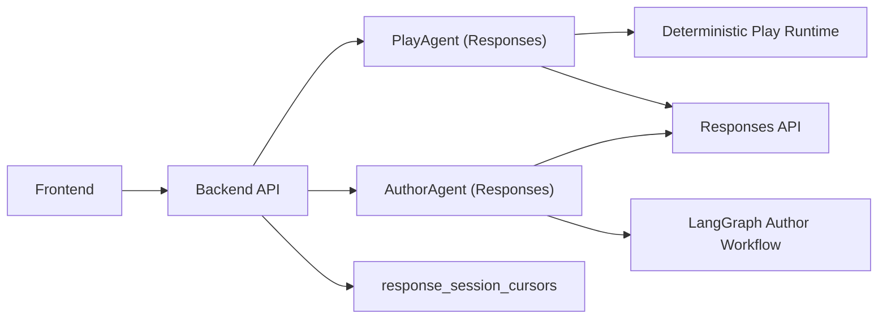

# RPG Demo

Single-backend architecture powered by a direct Responses API integration.

## Current Architecture



- No internal worker service in the active runtime path.
- Play Mode keeps deterministic resolution logic in backend code.
- Author Mode keeps LangGraph orchestration with deterministic non-LLM nodes.
- Provider-side KV reuse is done via `previous_response_id`, persisted per scope/channel in `response_session_cursors`.

## Responses Config

Use only these active env vars:

- `APP_RESPONSES_BASE_URL`
- `APP_RESPONSES_API_KEY`
- `APP_RESPONSES_MODEL`
- `APP_RESPONSES_TIMEOUT_SECONDS` (default `20.0`)
- `APP_RESPONSES_ENABLE_THINKING` (default `false`)

Reference template: [`/Users/lishehao/Desktop/Project/RPG_Demo/.env.llm.example`](/Users/lishehao/Desktop/Project/RPG_Demo/.env.llm.example)

## Local Development

```bash
./scripts/dev_stack.sh up
./scripts/dev_stack.sh ready
./scripts/dev_stack.sh logs backend
./scripts/dev_stack.sh logs frontend
```

Stop services:

```bash
./scripts/dev_stack.sh down
```

## Key API Contracts (unchanged)

- `POST /sessions`
- `POST /sessions/{session_id}/step`
- `POST /author/runs`

Public response shape for play/author remains stable; admin/dev telemetry fields now use single-agent semantics (`agent_model`, `agent_mode`, `response_id`, `reasoning_summary`).

## Migration Spec

Implementation contract for this migration:

- [`/Users/lishehao/Desktop/Project/RPG_Demo/responses_single_agent_migration_spec.md`](/Users/lishehao/Desktop/Project/RPG_Demo/responses_single_agent_migration_spec.md)

