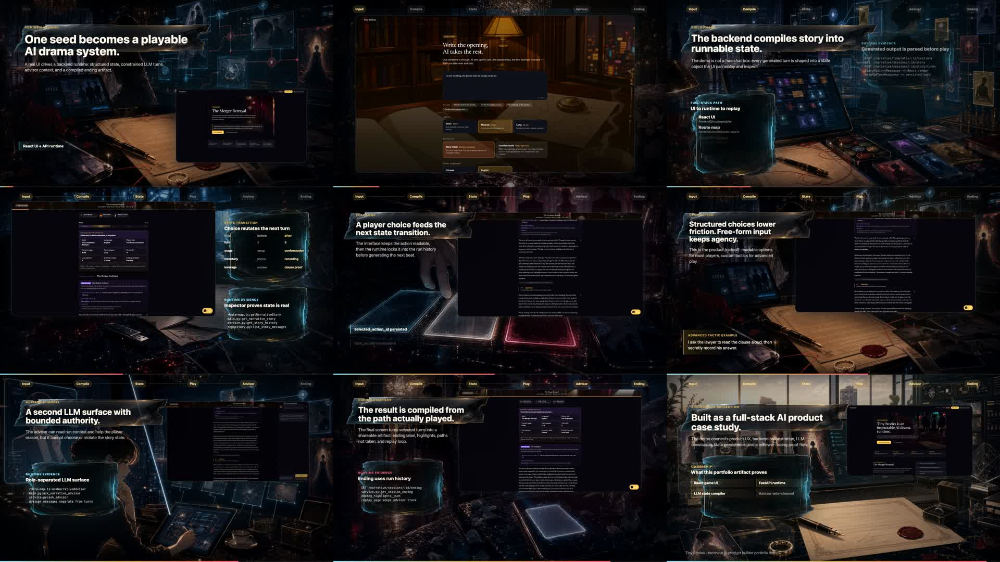
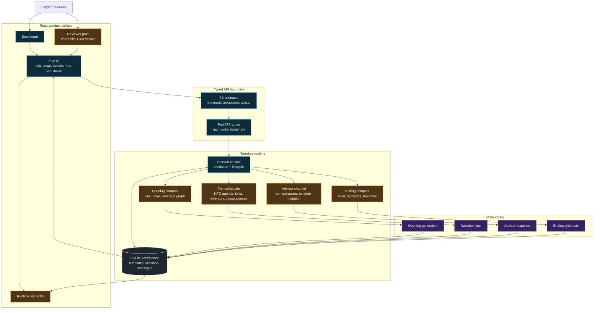

# Tiny Stories

<p align="center">
  <strong>An inspectable AI drama runtime: one seed becomes a playable 12-turn story with roles, state, advisor context, and a compiled ending.</strong>
</p>

<p align="center">
  <a href="./README.zh.md">中文</a> ·
  <a href="#demo">Demo</a> ·
  <a href="#innovation">Innovation</a> ·
  <a href="#architecture">Architecture</a> ·
  <a href="#run-locally">Run locally</a> ·
  <a href="./ARCHITECTURE.md">Deep dive</a>
</p>

<p align="center">
  
  
  
  
  
</p>

---

## Demo

[](https://lishehao.github.io/RPG_Demo/)

<p align="center">
  <a href="https://lishehao.github.io/RPG_Demo/"><strong>Watch the GitHub Pages demo</strong></a>
  ·
  <a href="./docs/demo-video/tiny-stories-admissions-demo-readme.mp4">Open compressed MP4</a>
  ·
  <a href="./docs/demo-video/admissions-narration.txt">Narration script</a>
</p>

The GitHub Pages demo contains a playable 720p compressed MP4 with
narration (~4.6 MB). It shows real app capture mixed with generated
Korean-webtoon keyframes: seed input, story generation, runtime state,
player choices, free-form action, advisor chat, and ending compilation.

---

## What This Is

Tiny Stories asks a narrow product question:

> Can an LLM story generator feel like a designed game runtime instead
> of a chatbot?

The answer here is a constrained full-stack system:

```text
seed
  -> story compiler
  -> cast + player role + hidden objectives + leverage network
  -> 12-turn play loop
  -> advisor side-channel + persistent state
  -> ending compiler + highlights + alternate branches
```

The project is best read as an AI product engineering case study. The
LLM writes prose, but the interesting work is the runtime around it:
typed contracts, deterministic schedulers, persisted state, visible
inspection surfaces, and a final artifact generated from the path
actually played.

---

## Innovation

| Layer | What is different | Engineering value |
| --- | --- | --- |
| **Seed-to-runtime compiler** | One premise becomes cast, roles, hidden objectives, leverage, failure conditions, and an opening scene. | Turns lightweight input into playable structure, not just generated prose. |
| **Player role model** | The player gets a public persona, private objective, starting assets, and leverage cards. | Makes the user a strategic actor rather than a passive reader. |
| **Deterministic scaffolding** | Python schedulers prepare NPC agenda, reversal pressure, inventory, and consequences before each LLM call. | Keeps pacing and state inspectable instead of leaving everything to the model. |
| **Bounded advisor channel** | A second LLM can reason over run context but cannot mutate story state. | Adds guidance without letting the assistant become the player. |
| **Ending compiler** | The final screen uses run history to produce a label, highlights, alternate branches, and replay path. | Makes a session reviewable and shareable. |
| **Reviewer mode** | `#/play/<session>?reviewer=1` exposes seed, stage, role, option count, inventory, and ending state. | Makes the project legible as an engineered system, not just a polished trailer. |

---

## Architecture

Gold nodes are the product innovations. Blue nodes are engineering
control points. Purple nodes are explicit LLM boundaries.



Each turn follows the same control pattern:

1. Deterministic schedulers assemble state: NPC agenda, twist pressure,
   current inventory, and recent consequences.
2. The LLM receives a constrained payload and returns structured output:
   narration, three options, NPC pulse shifts, and optional inventory
   deltas.
3. The repository persists the result before the UI renders the next
   state.

---

## Engineering Proof

| Area | What to inspect |
| --- | --- |
| Typed contracts | `rpg_backend/narrative/contracts.py`, `frontend2/src/api/contracts.ts` |
| Runtime orchestration | `rpg_backend/narrative/engine.py` |
| Persistence | `rpg_backend/narrative/repository.py` |
| HTTP/session flow | `rpg_backend/narrative/service.py`, `rpg_backend/main.py` |
| Play UI | `frontend2/src/pages/play/play-page.tsx` |
| Reviewer layer | `frontend2/src/pages/portfolio/` |
| Programmatic demo | `remotion-demo/src/AdmissionsDemoTrailer.tsx` |

Key engineering decisions:

- **Typed contract first**: Pydantic backend models mirrored by frontend
  TypeScript contracts.
- **Deterministic before generative**: schedulers define what the LLM
  should pay attention to each turn.
- **Persisted run history**: templates, sessions, messages, advisor
  messages, and endings are stored for replay and inspection.
- **Role-separated LLM calls**: narrator, advisor, and ending compiler
  have different authority and context.
- **Reviewer observability**: the portfolio path exposes runtime state
  that a normal player does not need to see.

---

## Run Locally

Requirements:

- Python 3.11+
- Node 18+
- An OpenAI-compatible chat/completions endpoint

```bash
pip install -e ".[dev]"
cp .env.example .env
# Fill:
#   APP_RESPONSES_PLAY_BASE_URL=...
#   APP_RESPONSES_PLAY_API_KEY=...
#   APP_RESPONSES_PLAY_MODEL=...

uvicorn rpg_backend.main:app --reload
```

In another terminal:

```bash
cd frontend2
npm install
npm run dev
```

Open `http://localhost:5173`. For the curated portfolio path, open
`http://localhost:5173/#/portfolio`.

Useful checks:

```bash
pytest -q

cd frontend2
npm run check
npm run build

cd ../remotion-demo
npm run check
npm run render:admissions
```

---

## Status

Tiny Stories is not positioned as a validated consumer product. Demand,
repeat play, and sharing loops remain unproven; see the
[pause memo](./docs/PROJECT_PAUSE_2026-05-09.md). What is complete is
the portfolio artifact: a playable full-stack loop, reviewer path,
runtime inspector, generated visual system, Remotion demo, and
architecture documentation.

MIT licensed. See [LICENSE](./LICENSE).
