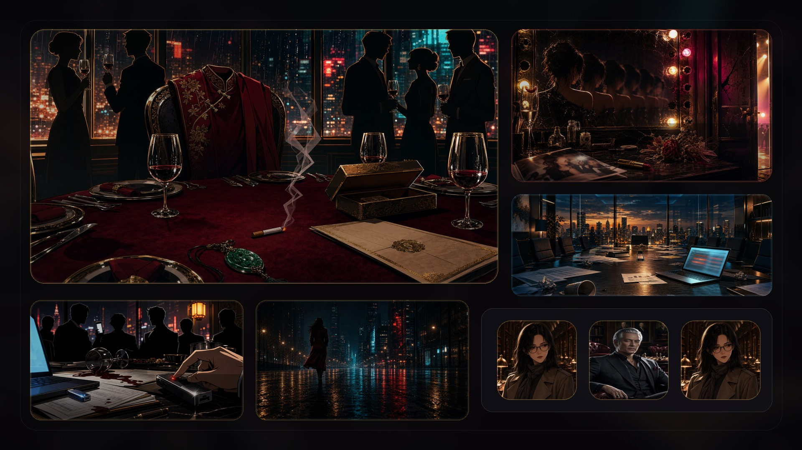
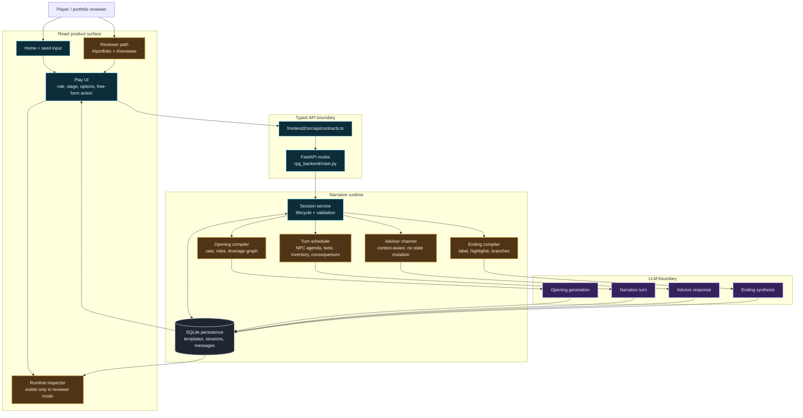

# Tiny Stories

<p align="center">
  
</p>

<p align="center">
  <strong>An inspectable AI drama runtime: one seed becomes a playable 12-turn story with roles, state, advisor context, and a compiled ending.</strong>
</p>

<p align="center">
  <a href="./README.zh.md">中文</a> ·
  <a href="./docs/demo-video/tiny-stories-admissions-demo-readme.mp4">Watch demo video</a> ·
  <a href="#reviewer-demo">Reviewer demo</a> ·
  <a href="#what-is-innovative">Innovation</a> ·
  <a href="#architecture">Architecture</a> ·
  <a href="./ARCHITECTURE.md">Deep dive</a> ·
  <a href="./docs/PROJECT_PAUSE_2026-05-09.md">Status memo</a>
</p>

<p align="center">
  
  
  
  
  
</p>

---

## What this is

Tiny Stories is a full-stack AI product case study built around a simple
question:

> Can an LLM story generator feel more like a designed game system than
> a chatbot?

The prototype answers that by constraining generation into a runtime:

```text
seed
  -> story compiler
  -> cast + player role + hidden objectives + leverage network
  -> 12-turn play loop
  -> advisor side-channel + persistent state
  -> ending compiler + highlights + alternate branches
```

The important part is not that an LLM writes prose. The important part
is the product layer around it: typed contracts, deterministic
schedulers, player-visible state, an advisor channel with bounded
authority, and a final artifact that makes a run reviewable.

This repository is best read as a portfolio artifact for AI product
engineering, interaction design, and LLM runtime orchestration.

---

## Demo

<p align="center">
  <a href="./docs/demo-video/tiny-stories-admissions-demo-readme.mp4">
    
  </a>
</p>

<p align="center">
  <a href="./docs/demo-video/tiny-stories-admissions-demo-readme.mp4">Watch compressed demo</a>
  ·
  <a href="./docs/demo-video/tiny-stories-admissions-demo.mp4">Open 1080p render</a>
  ·
  <a href="./docs/demo-video/admissions-narration.txt">Narration script</a>
</p>

The README video is a 720p compressed MP4 with narration (~4.6 MB).
The full 1080p Remotion render is kept separately for presentation use.

The demo shows the actual app flow mixed with cinematic Korean-webtoon
style frames:

- a locked English reviewer seed
- real UI entry and generated play surface
- visible runtime inspector
- structured choices plus free-form action
- advisor sidechat
- ending compilation into a shareable artifact

---

## What is innovative

Tiny Stories is not innovative because it asks an LLM to write fiction.
That part is the baseline. The project is stronger where it treats the
LLM as one component inside a constrained product runtime.

| Layer | Innovation | Why it matters |
| --- | --- |
| **Seed-to-runtime compiler** | One premise becomes cast, player role, hidden objectives, leverage, failure conditions, and an opening scene. | The product starts from a lightweight input but produces a playable structure, not just prose. |
| **Player role model** | The player enters with a public persona, private objective, starting assets, and leverage cards. | This makes the user a strategic actor rather than a passive reader. |
| **Deterministic turn scaffolding** | Python schedulers choose NPC agenda, reversal pressure, inventory, and consequence summary before the LLM writes. | The model is guided by explicit state and pacing constraints. |
| **Bounded advisor channel** | A second LLM surface can reason over run context but cannot mutate story state. | This adds help and strategy without letting the assistant become the player. |
| **Ending compiler** | The final artifact is generated from run history: label, subtitle, highlights, branches, replay path. | The session becomes reviewable and shareable instead of disappearing into chat history. |
| **Reviewer mode** | Portfolio path exposes seed, stage, role, options, inventory, and ending state. | Reviewers can inspect the system behavior instead of trusting a polished trailer. |

---

## Why it is not just a chatbot

| Common AI story demo | Tiny Stories runtime |
| --- | --- |
| Prompt in, prose out | Prompt in, playable session out |
| Infinite chat loop | Bounded 12-turn arc |
| User is mostly a reader | User receives a role, private objective, and leverage |
| The model invents state implicitly | State is persisted and surfaced in the UI |
| Assistant answers directly | Advisor is role-separated from the narrator and cannot choose for the player |
| Endings feel arbitrary | Ending compiler uses run history, highlights, and branches |
| Hard to evaluate | Reviewer mode exposes the runtime contract |

---

## Reviewer Demo

The app includes a portfolio-facing review path designed for admissions
or project reviewers.

| Path | Purpose |
| --- | --- |
| `#/portfolio` | Case-study page explaining the system as an inspectable AI drama runtime |
| `#/reviewer` | Launches a curated English run using the seed `The Merger Betrayal` |
| `#/play/<session>?reviewer=1` | Normal play surface with the reviewer runtime inspector enabled |

The reviewer seed is intentionally constrained:

```text
Minutes before the awards livestream, my cofounder announces our secret
merger onstage. My ex steps into the control room holding the recording
that proves I buried the deal.
```

That seed keeps the demo readable in English, matches the existing
manhwa-style business-scandal asset family, and shows the engineering
contribution clearly: generation is routed into a playable runtime, not
left as open-ended text completion.

---

## Product Surface

The current frontend has three layers:

- **Home / create flow**: enter a story seed, choose length, difficulty,
  language, and visibility.
- **Play surface**: stage bar, cast strip, player role, options,
  free-form action, private diary, advisor button, and ending screen.
- **Portfolio layer**: curated reviewer path, runtime inspector, system
  proof points, and visual asset gallery.

The visual direction is dark Korean webtoon drama: cinematic panels,
high-contrast UI, corporate betrayal / romance-thriller settings, and
generated character and ending art.

Primary style reference:



---

## Architecture

Tiny Stories is split into a React product surface, a FastAPI runtime,
typed persistence, and several explicit LLM boundaries. Gold nodes are
the main product innovations; blue nodes are the engineering control
points that make the system inspectable.



### Runtime loop

Each turn is assembled by deterministic Python schedulers before the
LLM writes the next beat:

1. Pick which NPC should push an agenda.
2. Force a reversal-stage twist when the arc reaches the right phase.
3. Recompute inventory from persisted history.
4. Summarize recent consequences and NPC pulse trends.
5. Send a structured payload to the LLM.
6. Persist passage, options, pulse shifts, and inventory deltas.

The result is still generative, but it is not unconstrained. The system
controls what the model sees, what shape it must return, and how the UI
interprets the next state.

For the full mechanism writeup, read [ARCHITECTURE.md](./ARCHITECTURE.md).

---

## Engineering Design

| Design decision | Implementation | Engineering reason |
| --- | --- | --- |
| **Typed contract first** | Pydantic models in `rpg_backend/narrative/contracts.py`, mirrored by `frontend2/src/api/contracts.ts`. | Keeps generated state, API responses, and UI rendering aligned. |
| **Deterministic before generative** | Schedulers prepare agenda, twist, inventory, and consequence payloads before each LLM call. | Reduces randomness and makes failures easier to inspect. |
| **Persist every meaningful turn** | SQLite repository stores templates, sessions, story messages, advisor messages, and ending artifacts. | Enables replay, reviewer inspection, and post-run synthesis. |
| **Role-separated LLM surfaces** | Narrator, advisor, and ending compiler are separate calls with different context and authority. | Prevents the advisor from becoming an uncontrolled second narrator. |
| **Reviewer-facing observability** | `#/play/<session>?reviewer=1` exposes runtime state that normal players do not need to see. | Makes the project legible as engineering, not only UX polish. |
| **Programmatic demo video** | Remotion composition mixes real UI captures, generated keyframes, and a generated narration track. | The portfolio artifact can be regenerated as the product changes. |

---

## Technical Proof Points

| Area | What to inspect |
| --- | --- |
| Typed contracts | `rpg_backend/narrative/contracts.py`, `frontend2/src/api/contracts.ts` |
| Runtime orchestration | `rpg_backend/narrative/engine.py` |
| Persistence | `rpg_backend/narrative/repository.py` |
| HTTP flow | `rpg_backend/narrative/service.py`, `rpg_backend/main.py` |
| Play UI | `frontend2/src/pages/play/play-page.tsx` |
| Portfolio layer | `frontend2/src/pages/portfolio/` |
| Demo video | `remotion-demo/src/AdmissionsDemoTrailer.tsx` |

---

## Quickstart

Requirements:

- Python 3.11+
- Node 18+
- An OpenAI-compatible chat/completions endpoint
  (OpenAI, DashScope, DeepSeek-compatible gateways, local Ollama adapters,
  vLLM, or SGLang)

```bash
# 1. Install backend dependencies
pip install -e ".[dev]"

# 2. Configure the LLM endpoint
cp .env.example .env
# Fill at least:
#   APP_RESPONSES_PLAY_BASE_URL=...
#   APP_RESPONSES_PLAY_API_KEY=...
#   APP_RESPONSES_PLAY_MODEL=...

# 3. Start the backend on port 8000
uvicorn rpg_backend.main:app --reload
```

In another terminal:

```bash
cd frontend2
npm install
npm run dev
```

Open `http://localhost:5173`.

To review the curated portfolio path, open:

```text
http://localhost:5173/#/portfolio
```

Then launch the reviewer demo.

First generation usually takes longer than a normal turn because the
system has to compile the cast, player roles, leverage graph, failure
conditions, and opening scene.

---

## Smoke Test

Once `.env` is configured, you can test the story compiler without the
frontend:

```bash
python -c "
from rpg_backend.narrative import engine
from rpg_backend.narrative.gateway import get_narrative_gateway

gw = get_narrative_gateway()
opening = engine.generate_opening(
    gateway=gw,
    seed='Minutes before the awards livestream, my cofounder announces a secret merger that cuts me out',
)

edges = sum(len(c.leverages_over_other_npcs) for c in opening.cast)
print(f'Title: {opening.title}')
print(f'NPCs: {len(opening.cast)} | Roles: {len(opening.player_role_options)} | Inter-NPC edges: {edges}')
"
```

---

## Development

Backend:

```bash
pytest -q
```

Frontend:

```bash
cd frontend2
npm run check
npm run build
```

Demo video:

```bash
cd remotion-demo
npm run check
npm run render:admissions
```

The project currently uses TypeScript strict checks and pytest as its
main quality gates. There is no ruff / eslint / prettier setup yet.

---

## Repository Map

```text
rpg_backend/
  narrative/             Core 12-turn drama runtime
    contracts.py         Pydantic contracts
    engine.py            Prompts, schedulers, parsers
    repository.py        SQLite persistence and migrations
    service.py           Session business flow
    gateway.py           OpenAI-compatible LLM client wrapper
  main.py                FastAPI app
  auth/                  Cookie session support
  config.py              APP_ settings

frontend2/
  src/pages/home/        Home and entry flow
  src/pages/create/      Seed and generation setup
  src/pages/play/        Main play surface
  src/pages/portfolio/   Reviewer-facing case-study path
  src/shared/            UI, motion, assets, i18n
  public/webtoons/       Generated visual asset library

remotion-demo/
  src/AdmissionsDemoTrailer.tsx
                          Portfolio demo video composition

docs/
  demo-video/            Script, captures, keyframes, rendered videos
  images/                Hero, social preview, style references
  devlog/                Design notes

specs/                   Older product and architecture specs
deploy/aws_ubuntu/       Single-machine deployment example
tests/                   Pytest suite
```

---

## Current Status

Tiny Stories is not being positioned as a validated consumer product.
As of the May 2026 pause memo, demand, repeat play, and sharing loops
are still unproven.

What is complete enough to evaluate:

- playable full-stack loop
- English reviewer path
- visible runtime inspector
- generated webtoon asset library
- Remotion portfolio demo
- architecture documentation

What still needs real validation:

- human playtest data
- replay intent
- sharing behavior
- latency and failure recovery under varied model providers
- whether this should become a game, a writing tool, or remain a
  portfolio case study

Read [the pause memo](./docs/PROJECT_PAUSE_2026-05-09.md) before
restarting product work.

---

## Roadmap

Short term:

- Add CI for pytest and frontend type-check.
- Run 5-10 real playtests and record where players feel agency.
- Add latency / failure telemetry to the reviewer path.
- Sync the Chinese README with the portfolio-facing English README.

Medium term:

- Stream narration into the play UI.
- Make the leverage map visible during play.
- Add multi-provider evaluation runs across the same seed.
- Produce a smaller web-ready demo video artifact.

---

## License

MIT. See [LICENSE](./LICENSE).

AI-generated visual assets in this repository are intended to be used
with the project under the same license unless a file states otherwise.
