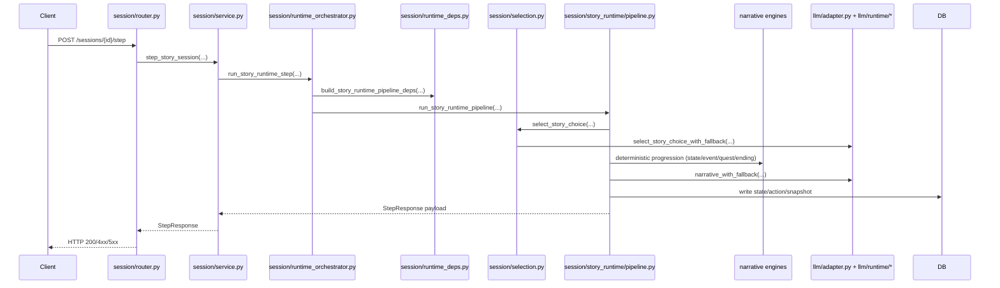
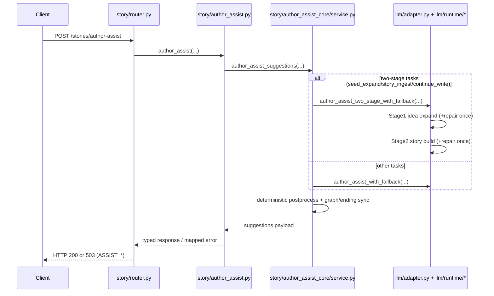
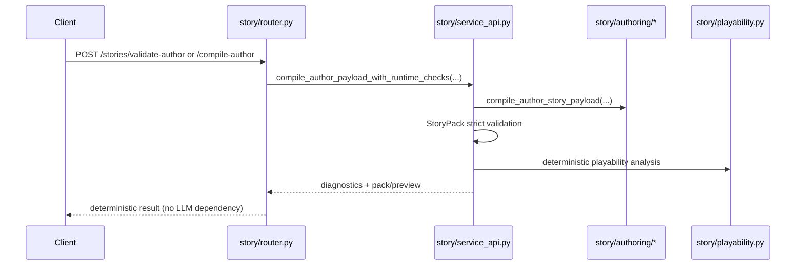

# LLM 职责边界与排障手册（中文）

本文档说明 RPG Demo 当前架构下的职责边界，目标是防止 LLM 能力渗透到确定性业务层。

## 1. 一句话边界

1. LLM 负责“文本与建议”。
2. 确定性引擎负责“可执行后果与状态推进”。
3. Author Assist 保持 suggestion-only，不直接持久化。
4. 历史 Story 兼容已硬切，运行时只接受 StoryPack v10 strict。

## 2. 责任矩阵（Owner Matrix）

| 模块 | 输入解析 | 结构生成 | 后果计算 | 状态推进 | 文本生成 | 持久化 | 调试观测 |
| --- | --- | --- | --- | --- | --- | --- | --- |
| `app/modules/story/router.py` | HTTP 请求/响应 | 否 | 否 | 否 | 否 | 否 | 状态码映射 |
| `app/modules/story/service_api.py` | Author payload 入口 | compile/validate 编排 | 否 | 否 | 否 | 否 | compile/validate diagnostics |
| `app/modules/story/author_assist.py` | Assist 请求入口 | suggestion 编排 | 否 | 否 | 间接（经 LLM） | 否 | assist diagnostics |
| `app/modules/story/author_assist_core/*` | task 细化上下文 | patch/postprocess | 否 | 否 | 否 | 否 | 结构修复与轨迹 |
| `app/modules/story/authoring/*` | ASF v4 schema | ASF v4 -> StoryPack | 否 | 否 | 否 | 否 | author diagnostics |
| `app/modules/session/service.py` | Session API 编排 | 否 | 编排/委托 | 编排/委托 | 编排/委托 | DB 读写 | debug views 聚合 |
| `app/modules/session/runtime_orchestrator.py` | Step 运行入口 | phase 调度编排 | 编排/委托 | 编排/委托 | 编排/委托 | 否 | runtime 结果汇总 |
| `app/modules/session/story_runtime/pipeline.py` | step 上下文 | 否 | 编排 deterministic phase | 编排 deterministic phase | narration（经 LLM） | ActionLog/Snapshot | layer_debug |
| `app/modules/session/story_runtime/phases/*` | phase 输入 | 局部 phase 输出 | 是 | 是 | 否 | 否 | phase 级调试字段 |
| `app/modules/narrative/*_engine.py` | 规则输入 | 否 | 是 | 是 | 否 | 否 | engine deterministic outputs |
| `app/modules/llm/runtime/*` | 协议/重试/解析 | 否 | 否 | 否 | 否 | 否 | LLM 调用异常上抛 |

## 3. LLM 触点白名单

允许直接 import `app.modules.llm` 的业务模块仅限：

1. `app/modules/session/selection.py`
2. `app/modules/session/service.py`
3. `app/modules/session/story_runtime/pipeline.py`
4. `app/modules/story/author_assist.py`

禁止触点：

1. `app/modules/story/authoring/*`
2. `app/modules/story/service_api.py`
3. `app/modules/narrative/*`

边界由 `tests/test_architecture_boundaries.py` 守护。

## 4. 端到端流程图

### 4.1 Play Step（`POST /sessions/{id}/step`）

### 4.2 Author Assist（`POST /stories/author-assist`）

### 4.3 Compile / Validate（纯确定性链路）

## 5. 硬切旧 Story 运行策略（必须遵守）

1. Authoring 入口只接受 ASF v4，低版本返回 `422 AUTHOR_V4_REQUIRED`。
2. 服务启动阶段会扫描 `stories.pack_json`，发现旧/不合规 pack 直接阻止启动：
- `LEGACY_STORYPACKS_BLOCK_STARTUP`
3. 运行时加载 story pack 不再做兼容投影，非 strict pack 直接失败：
- `RUNTIME_PACK_V10_REQUIRED`

## 6. 修改入口指南

1. 想改叙事风格或结构化协议：
- `app/modules/llm/prompts.py`
- `app/modules/llm/runtime/protocol.py`
- `app/modules/llm/runtime/parsers.py`

2. 想改玩法后果（资源/任务/事件/结局）：
- `app/modules/narrative/*_engine.py`
- `app/modules/session/story_runtime/phases/progression.py`

3. 想改 Author Assist 任务行为：
- `app/modules/story/author_assist_core/*`
- `app/modules/story/author_assist.py`（只保留 API 门面语义）

4. 不要做的事：
- 不要在 `authoring` 编译器引入 LLM 调用。
- 不要在 `service_api` compile/validate 路径引入 LLM 依赖。
- 不要让 narrative wording 决定状态推进。

## 7. 故障分类与定位路径

1. 启动失败：
- 看到 `LEGACY_STORYPACKS_BLOCK_STARTUP`，先定位不合规 `story_id/version`，修复或删除后再启动。
- 入口：`app/modules/session/runtime_deps.py`。

2. Author Assist 失败：
- `ASSIST_LLM_UNAVAILABLE`：网络/服务可达性问题。
- `ASSIST_INVALID_OUTPUT`：结构输出契约问题（JSON parse/schema required fields）。
- 入口：`app/modules/story/author_assist.py`、`app/modules/story/author_assist_core/service.py`、`app/modules/llm/runtime/parsers.py`。

3. Play 文本异常但结算正常：
- 看 narration prompt 与 payload，不要改 deterministic engine。
- 入口：`app/modules/session/story_runtime/phases/narration.py`、`app/modules/llm/prompts.py`。

4. 后果/任务推进异常：
- 看 deterministic phases 与 narrative engines，不要先改 prompt。
- 入口：`app/modules/session/story_runtime/phases/progression.py`、`app/modules/narrative/*_engine.py`。

## 8. 架构改动 PR Checklist

1. 是否在非白名单模块新增了 `app.modules.llm` 依赖？
2. 是否改变了 `/stories/*` 或 `/sessions/*` 对外契约（路径/状态码/返回 shape）？
3. 是否重新引入了旧 Story 兼容路径（违背硬切）？
4. 是否把业务编排塞回 router 或让 service 越层？
5. 是否跑过最小回归集（见 `docs/verification.md`）？

## 9. 相关文档

1. 总体结构：`docs/code-structure.md`
2. 作者使用手册：`docs/author-mode-zh.md`
3. API 约定：`docs/api.md`
4. 验证命令：`docs/verification.md`
