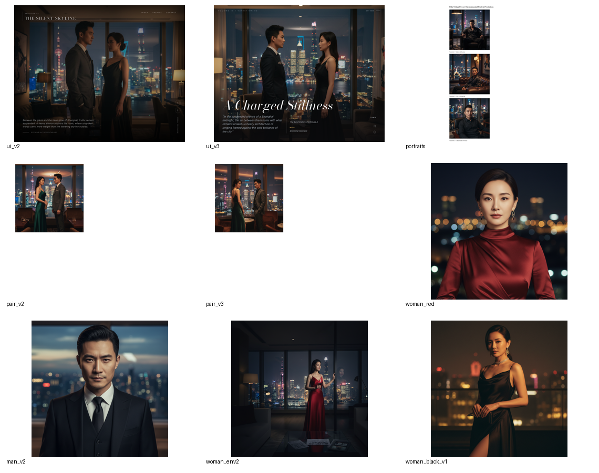
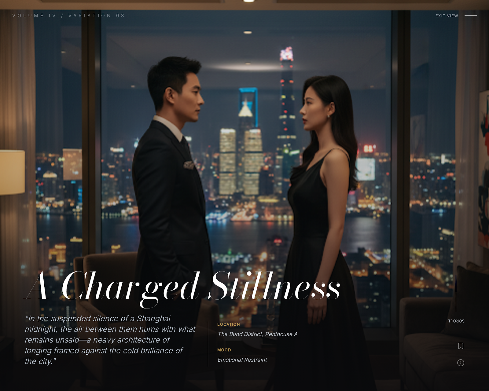
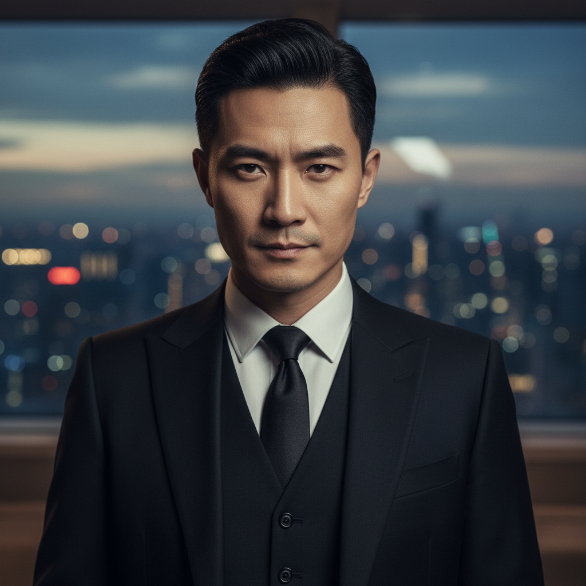
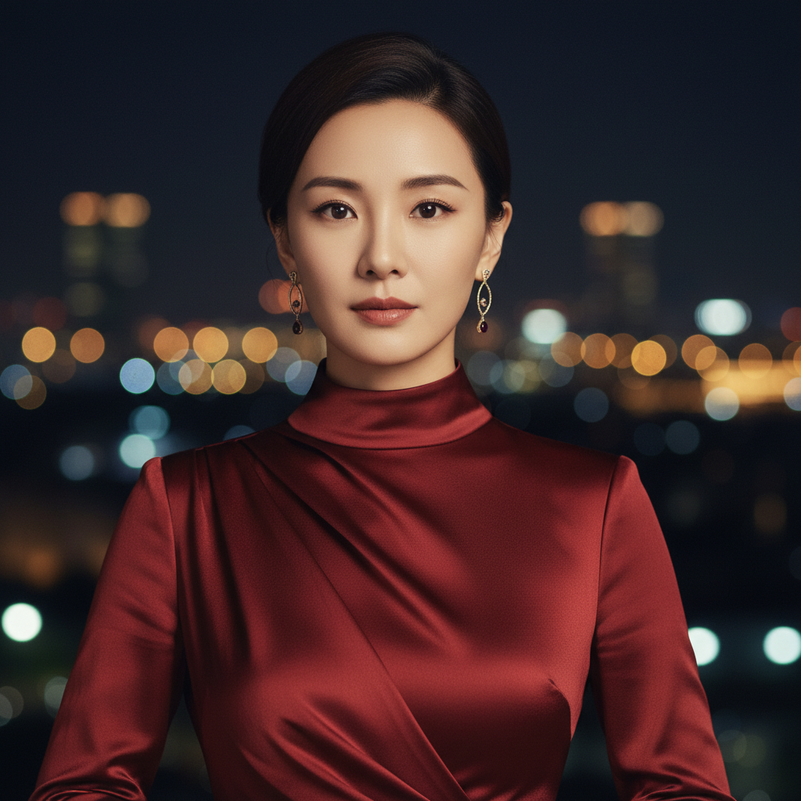
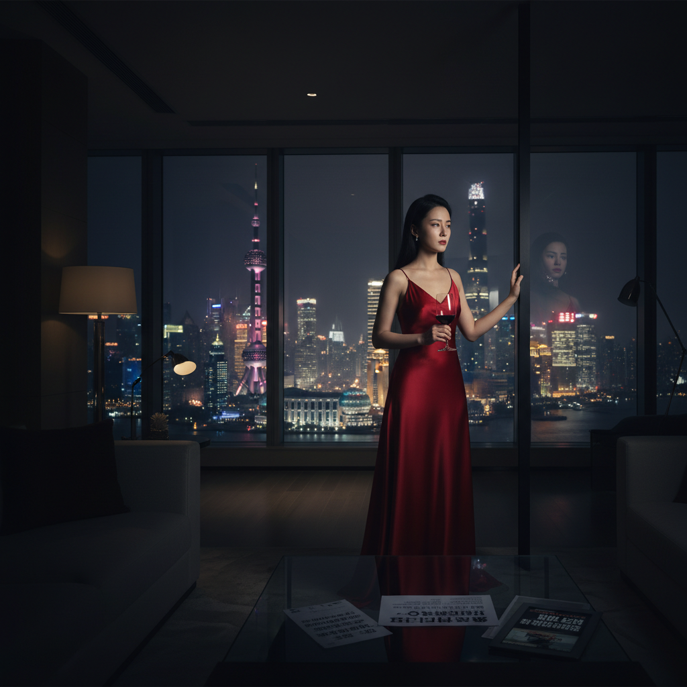
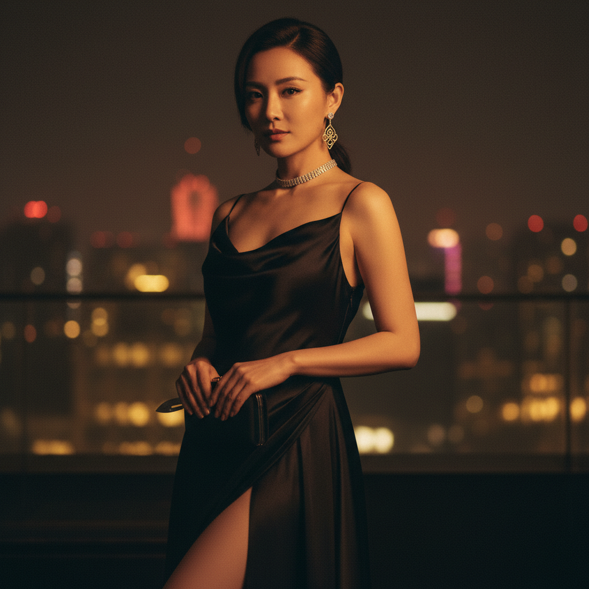

# UI 肖像风格 Spec

## 目的

为 `Gossip & Glory / 案卷剧场` 的前端页面锁定一套统一的人像与环境图风格，避免后续：

- 人物卡像时尚广告
- hero 图像像影视宣发海报
- 双人关系图像像婚纱照或摆拍
- 单人环境图和人物档案图彼此不属于同一个世界

这份 spec 约束：

- 人像生成 prompt
- 选图标准
- 页面槽位适配
- 正反例边界

它不是在定义“某个角色长什么样”，而是在定义：

`这款产品里，人物图应该像哪一种高级都市关系戏剧照。`

## 总体定调

### 核心结论

整套 UI 的人物与环境图统一定为：

- `中国都市高端关系戏`
- `电影写实`
- `杂志级光线`
- `克制的危险感`
- `空间参与叙事`

不是：

- 偶像宣发海报
- 美妆广告
- 奢侈品 campaign
- 婚纱照式关系图
- 西式旧贵族视觉
- 插画 / 二次元 / 柔焦海报

### 一句话标准

`像高端中国都市关系戏的杂志级剧照，不像 AI 生成的宣传海报。`

## 选定的代表案例

### 总览联系表

### 1. 双人关系主基准

文件：

- `assets/hero_dual_reference.png`

结论：

- 这是整套世界观的主基准
- 适合定义 `hero / featured dossier / 双人关系主视觉`

为什么选它：

- 中国都市顶层空间成立
- 城市夜景、室内灯光、人物距离、情绪压迫都成立
- 既有高级感，也有危险感
- 最像“关系戏剧照”，不是普通物料图

### 2. 男角色卡基准

文件：

- `assets/male_profile_reference.png`

结论：

- 男性人物档案卡统一优先参考这一张

为什么选它：

- 写实稳定
- 五官自然
- 有权力感，但不油腻
- 不像 AI 偶像海报男主
- 非常适合 `profile card / cast dossier`

### 3. 女角色卡基准

文件：

- `assets/female_profile_reference.png`

结论：

- 女性人物档案卡以这张为主参考
- 但后续 prompt 必须稍微压低“商业写真感”

为什么选它：

- 正脸识别度高
- 裁切清楚
- 服装、耳饰、背景、肤感都足够高级
- 非常适合 UI 卡面

需要修正的地方：

- 不能再更精修
- 要比这张再多一点阴影和危险感
- 避免美妆广告味

### 4. 单人环境叙事基准

文件：

- `assets/environment_single_reference.png`

结论：

- 适合 `create hero / loading hero / 单人环境剧情图`

为什么选它：

- 人物与空间一起成立
- 顶层 / 夜景 / 酒杯 / 灯光 / 落地窗语法完整
- 能帮助页面在第一屏建立“豪门 / 夜色 / 名利场”的世界观

### 5. 危险变体参考

文件：

- `assets/noir_variant_reference.png`

结论：

- 只能做“危险变体”
- 不能当整套女性角色主标准

适合用途：

- 黑裙危险人物
- noir 模块
- 局部高压人物 spotlight

不适合用途：

- 全站女性角色基准
- 大量人物卡批量生成

原因：

- 太接近时尚广告
- 太容易把产品拉向奢侈品 campaign

## 槽位使用规则

### A. Hero / Featured Dossier

使用基准：

- `hero_dual_reference`
- `environment_single_reference`

要求：

- 必须有真实空间
- 必须有城市夜景或高端室内线索
- 人物不能只是站在纯色背景前
- 文本区必须有可读净空

禁止：

- 柔焦偶像双人海报
- 纯人物 cutout 贴背景
- 太满、太挤、没有留标题位置

### B. Profile Card / Cast Dossier

使用基准：

- 男：`male_profile_reference`
- 女：`female_profile_reference`

要求：

- 胸像或半身优先
- 面部清晰
- 表情克制
- 背景真实但虚化
- 有高端都市夜生活 / 顶层 / 酒会 / 室内光线痕迹

禁止：

- 纯棚拍感
- 过度磨皮
- 明星海报式直视镜头且过分“完美”
- 夸张珠宝、夸张妆造

### C. Relationship / Secret Modules

使用基准：

- `hero_dual_reference`
- 少量 `noir_variant_reference`

要求：

- 重点是“张力”，不是“亲密”
- 两人之间有距离感、权力差、信息差
- 空间和光线要参与叙事

禁止：

- 拥抱
- 婚纱照站姿
- 明显情侣写真感
- 廉价狗血表情

## 出图规则

### 人物质感

必须满足：

- 真实皮肤纹理
- 真实头发和发际线
- 真实眼神焦点
- 不过度对称
- 不塑料

### 灯光规则

优先：

- 暖室内光 + 冷夜景
- 阴影明确
- 反射和玻璃感存在
- 杂志级柔和明暗，不是强商业闪光灯

避免：

- 平光
- 影棚白底
- 霓虹赛博
- 过重 LUT 感

### 色彩规则

主色域应兼容当前 UI：

- oxblood
- ivory
- soot
- muted gold

图像不要求完全同色，但要能自然放进这套 UI 里，不抢色、不漂色。

## 明确排除

以下风格一律视为错误方向：

- 偶像剧宣发海报
- AI 柔焦情侣图
- 奢侈品香水广告
- 西式旧贵族与庄园视觉
- 古风 / 宫廷 / 民国
- 赛博朋克 / 霓虹紫蓝
- 插画感、二次元感、摄影棚棚拍感

## Prompt 约束

后续所有人物 prompt 默认都应包含这些隐含规则：

- contemporary Chinese urban elite drama
- cinematic realism
- editorial photography
- emotionally dangerous
- luxury but restrained
- realistic skin texture
- no beauty-campaign softness
- no wedding-photo intimacy
- no fantasy / no cyberpunk / no palace / no western aristocracy

## 执行标准

后续每次新图审核时，都按这 4 个问题判断：

1. 这张图像不像真实的中国都市高端关系戏？
2. 它更像剧照，还是更像广告 / 海报？
3. 它能不能自然放进当前 dossier UI？
4. 它会不会把产品视觉拉偏？

如果第 2 条答案更偏“广告 / 海报”，默认淘汰。

